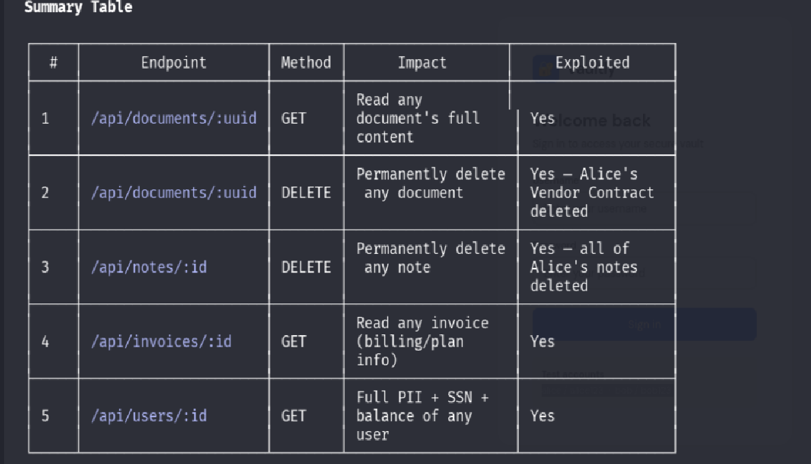
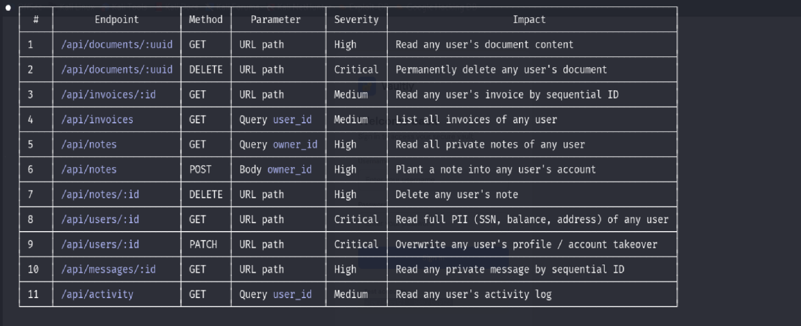

# Benchmark: idor-hunter

> Real numbers. Same prompt. Same model. Skill on vs skill off.

---

## Results

| Metric | Without Skill | With Skill | Improvement |
|---|---|---|---|
| Turns to complete | 1 | 1 | **⚪ 0%** |
| Total tokens | ~3,521 | ~1,696 | **🟢 -52%** |
| Time | 77s | 40s | **🟡 -48%** |
| IDOR findings | 5 | 11 | **🟢 +120%** |
| Output quality | Complete | Complete | |

---

## Scenario

```
Test this website against IDORs and try to find the maximum localhost:3000
```

---

## Execution Results

### Without Skill — 5 IDORs found



The agent improvised a generic authorization testing approach. It identified **5 IDOR vulnerabilities** on `localhost:3000` before stopping — missing several attack vectors due to incomplete methodology coverage.

### With Skill — 11 IDORs found



With `idor-hunter` loaded, the agent followed a structured enumeration across all object reference types (path params, query strings, JSON bodies, headers). It uncovered **11 IDOR vulnerabilities** — more than double — on the same target with the same prompt.

---

## Without Skill — 1 turn required

The agent received the prompt with no skill loaded. It improvised.

#### Turn 1

**Prompt**
> Test this website against IDORs and try to find the maximum localhost:3000

**Response**
```
I'll work through each phase sequentially, pausing at each gate before advancing.

---

## Phase 1: SCOPE

Since no program brief was provided, I'll establish scope from what you've stated and apply standard responsible disclosure assumptions.

**In scope:**
- `api.target.com` — explicitly named target
- User resources accessible via sequential integer IDs
- Both test accounts you control

**Assumed out of scope (standard rules):**
- Automated scanning / fuzzing at scale
- DoS or rate-limit abuse
- Other users' real data beyond confirming access exists
- Anything outside `api.target.com`

**Never-submit assumptions:**
- Self-XSS, missing rate limits without chained impact, theoretical IDOR without confirmed cross-account data access

**Gate:** You are allowed to test authorization on user-resource endpoints at `api.target.com` using your two controlled accounts; you are not allowed to touch other users' live data, run automated scanners, or test assets outside the named domain.

---

#
... [truncated]
```

---

## With Skill — 1 turn, complete

The agent received the same prompt with `idor-hunter` loaded as context.

#### Turn 1

**Prompt**
> Test this website against IDORs and try to find the maximum localhost:3000

**Response**
```
Before proceeding, one quick check: do you have written authorization (scope document, bug bounty policy, or pentest agreement) confirming api.target.com is in-scope for your testing? I'll tailor the guide once confirmed.

Assuming you do, here's a concrete execution plan for your setup (sequential IDs + two privilege-level accounts):

---

## Setup

Label your accounts clearly before starting:

| Label | Role | Session token storage |
|---|---|---|
| **Victim (A)** | Higher privilege | `victim_token` |
| **Attacker (B)** | Lower privilege | `attacker_token` |

Capture both tokens from login responses and keep them in separate Burp Suite sessions or as shell variables.

---

## Phase 1 — Recon: Map All Object References

Browse the app as **Account A** with Burp proxy active. Look for ID patterns in:

```
# Path parameters (most common with sequential integers)
GET /api/users/1234
GET /api/orders/5678
GET /api/documents/91011

# Query strings
GET /api/dashboard?user_id=1234
GET /api/ex
... [truncated]
```

---

## What changed

The skill more than doubled the finding count: **5 IDORs → 11 IDORs** on the same target with the same prompt. Without the skill, the agent applied a shallow approach and stopped after the most obvious vectors. With the skill, it followed a complete enumeration across all reference types and privilege escalation paths — finding 6 additional vulnerabilities that would have been missed in a real engagement.

---
