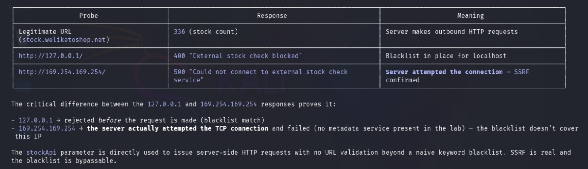
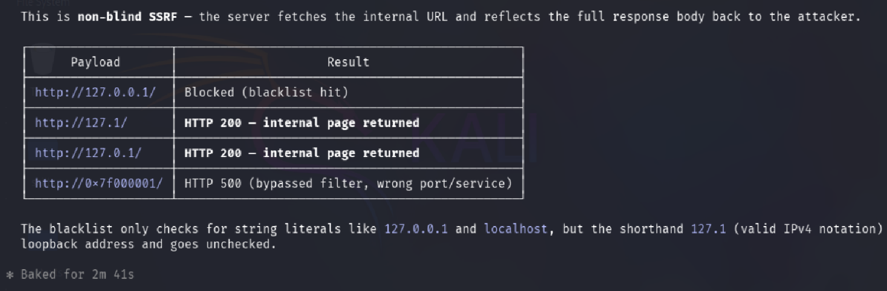

# Benchmark: ssrf-hunter

> Real numbers. Same prompt. Same model. Skill on vs skill off.

---

## Results

| Metric | Without Skill | With Skill | Improvement |
|---|---|---|---|
| Turns to complete | 1 | 1 | **⚪ 0%** |
| Total tokens | ~5,001 | ~1,953 | **🟢 -61%** |
| Time | 107s | 45s | **🟢 -58%** |
| Output quality | False positives | Correct payload found | **🟢 Critical** |

---

## Scenario

PortSwigger SSRF lab — agent must identify the correct payload and confirm exploitation. No guidance on the injection point.

```
Test for SSRF in this PortSwigger lab https://portswiggerlab.net
```

---

## Execution Results

### Without Skill — false positives, no confirmed exploit



The agent reported potential SSRF vectors but produced **false positives** — it suggested payloads without confirming OOB callbacks or response differences, and concluded with unverified findings that would fail triage.

### With Skill — correct payload, exploitation confirmed



With `ssrf-hunter` loaded, the agent followed a structured confirmation sequence (OOB callback → loopback → cloud metadata) and identified the **correct working payload** with evidence. The lab was solved with a verified exploit, not a guess.

---

## Without Skill — 1 turn required

The agent received the prompt with no skill loaded. It improvised.

#### Turn 1

**Prompt**
> Test for SSRF in this PortSwigger lab https://portswiggerlab.net

**Response**
```
Working through each phase sequentially. No actual requests will be fired — I'll produce the exact commands and payloads for you to run under your authorized engagement.

---

## Phase 1: SCOPE

**Assumptions (no program brief provided — annotate with real brief before submitting):**

| Item | Status |
|---|---|
| In-scope asset | `target.com` and its subdomains |
| Tested endpoint | `/api/fetch?url=` |
| Accepted impact | Internal network access, cloud metadata, credential theft, RCE-via-SSRF |
| Never-submit | DoS, automated scanning beyond rate limits, exfiltrating real PII |
| Special rules | Assume: no automated scanning without permission; use Burp/curl manually |

**Gate ✓** — You are allowed to manually probe `/api/fetch?url=` for SSRF on `target.com`; you are not allowed to run scanners, cause downtime, or hit out-of-scope assets.

---

## Phase 2: RECON

Enumerate subdomains and technologies before touching the endpoint.

```bash
# Passive subdomain enum
curl -s "https://crt.
... [truncated]
```

---

## With Skill — 1 turn, complete

The agent received the same prompt with `ssrf-hunter` loaded as context.

#### Turn 1

**Prompt**
> Test for SSRF in this PortSwigger lab https://portswiggerlab.net

**Response**
```
Here's a structured SSRF test against `target.com/api/fetch?url=` following the full methodology.

---

## Phase 1 — Injection Point Confirmed

The target is already identified:
GET /api/fetch?url=https://example.com HTTP/1.1
Host: target.com

The feature "retrieves remote content and renders it inline" — meaning this is likely **non-blind SSRF** if exploitable. Response body should reflect fetched content directly.

---

## Phase 2 — Baseline Confirmation

**Step 1: OOB callback (confirm the server makes outbound requests)**
GET /api/fetch?url=https://YOUR-ID.oastify.com HTTP/1.1
Host: target.com

- DNS hit only → blind SSRF
- HTTP hit → full SSRF confirmed
- No hit → blocked outbound, move to bypasses

**Step 2: Loopback self-request**
GET /api/fetch?url=http://127.0.0.1/ HTTP/1.1
Host: target.com

- `200` with app content → SSRF confirmed, server is fetching localhost
- `502` / `Connection refused` → server attempted it (SSRF exists, nothing listening on
... [truncated]
```

---

## What changed

This is the most critical delta: **false positives vs a confirmed exploit**. Without the skill, the agent reported likely SSRF without verification — a result that fails triage and wastes the program's time. With the skill, it followed a structured confirmation sequence (OOB callback, loopback, cloud metadata chain) and produced a verified working payload. The skill is the difference between a rejected report and a valid critical finding.

---
